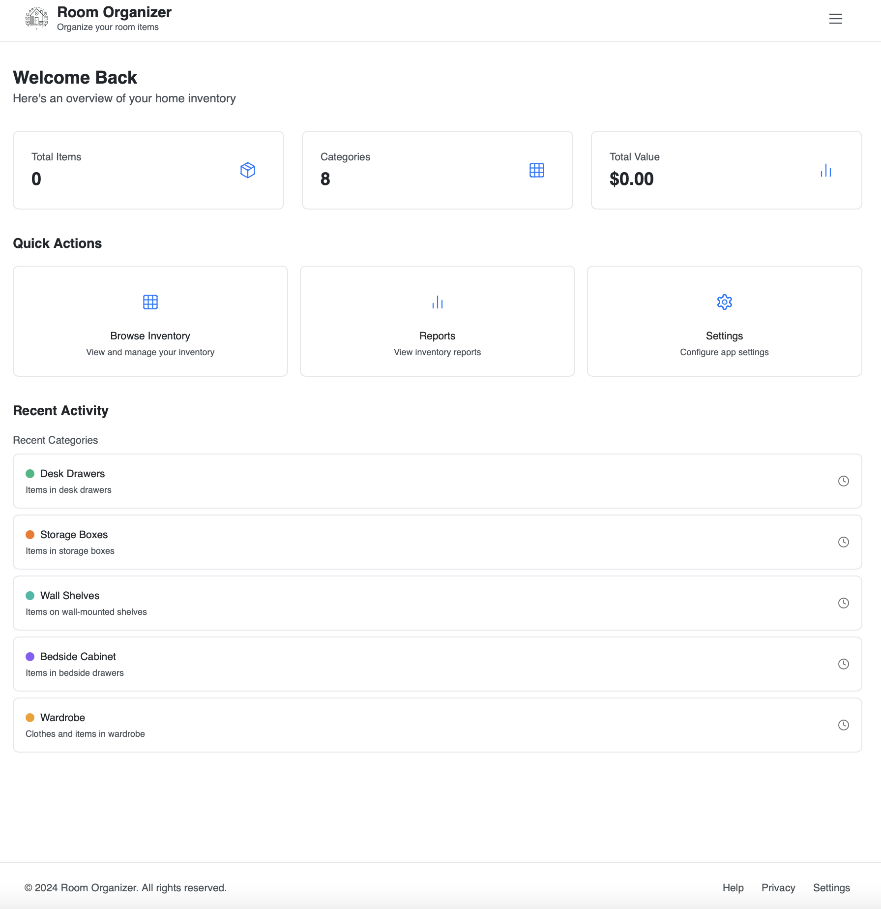
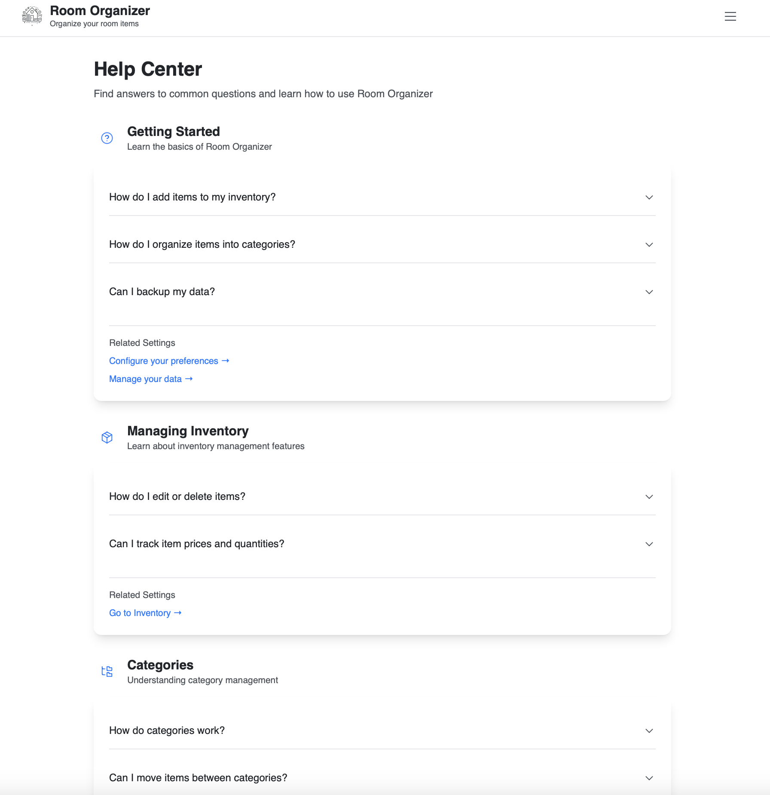
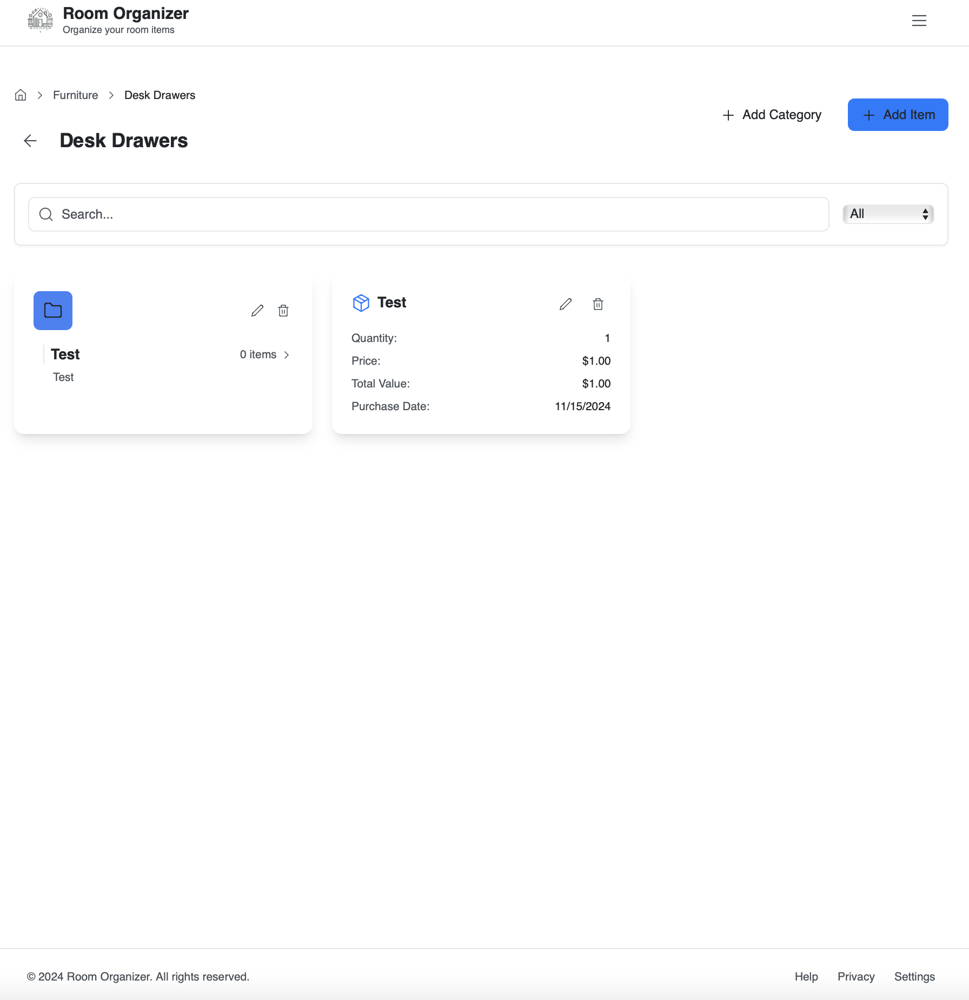
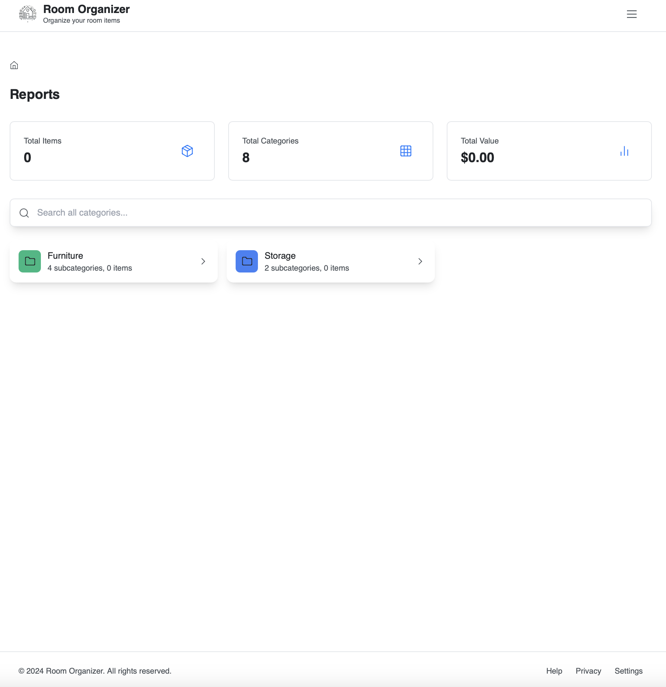
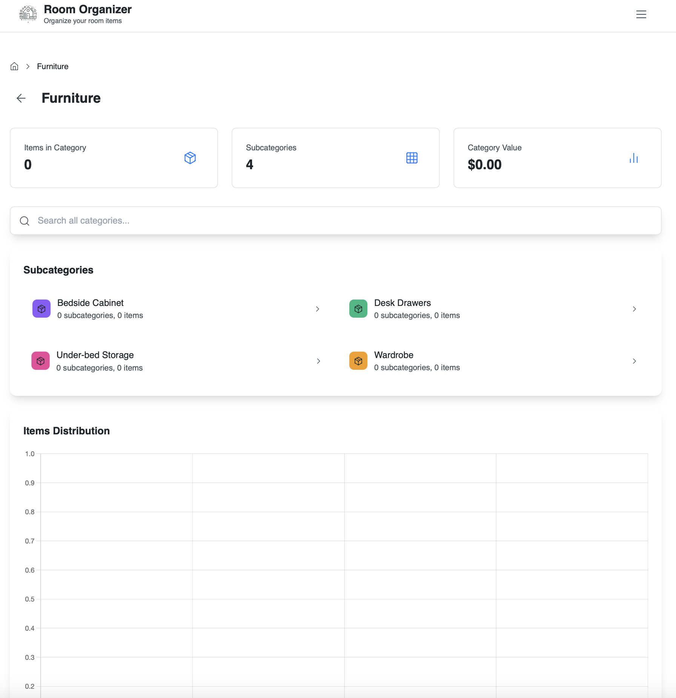
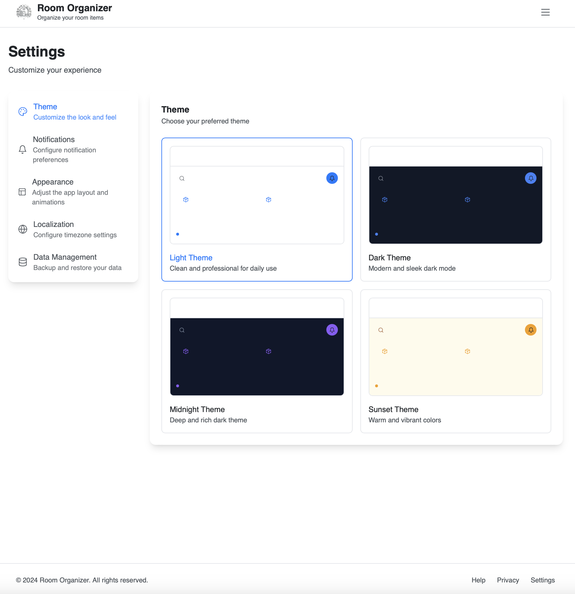

# Room Organizer

Welcome to Room Organizer, a vibrant and engaging web application designed to help you efficiently manage and organize your room inventory. Built with the latest technologies like React, TypeScript, and Vite, Room Organizer is your go-to solution for inventory management.

## Features

- **Inventory Management**: Seamlessly add, edit, and organize your room items with comprehensive details such as name, category, quantity, and price.
- **Category System**: Effortlessly create nested categories and subcategories for optimal item organization.
- **Reports & Analytics**: Gain insights with interactive charts showing category-wise distribution, total inventory value, and item counts.
- **Search & Filter**: Instantly locate items using the powerful search functionality and category filters.
- **Responsive Design**: Enjoy a seamless experience across desktop, tablet, and mobile devices.
- **Theme Customization**: Personalize your experience with Light, Dark, Midnight, and Sunset themes.
- **Data Management**: Easily export and import data for backup and transfer between devices.
- **Localization**: Experience support for multiple languages and currency formats.

## Deployment

The application is live on GitHub Pages at: [Room Organizer](https://omidnw.github.io/room-organizer/)

### Manual Deployment

To manually deploy the application to GitHub Pages:

1. Build the application:
   ```bash
   yarn build
   ```

2. Deploy to GitHub Pages:
   ```bash
   yarn deploy
   ```

### Automatic Deployment

Room Organizer automatically deploys to GitHub Pages when changes are pushed to the main branch, thanks to GitHub Actions.

## Tech Stack

- React 18 with TypeScript
- Vite for rapid development and building
- Framer Motion for smooth animations
- Chart.js for analytics visualization
- Tailwind CSS for styling
- IndexedDB for local data storage
- i18next for internationalization
- Workbox for PWA capabilities

## Getting Started

1. Clone the repository:

   ```bash
   git clone https://github.com/yourusername/room-organizer.git
   cd room-organizer
   ```

2. Install dependencies using Yarn:

   ```bash
   yarn
   ```

3. Start the development server:

   ```bash
   yarn dev
   ```

4. Open your browser and navigate to `http://localhost:5173` to explore the application.

## Screenshots

### Home Page



### Help Center



### Item View



### Reports



### Reports with Details



### Settings


